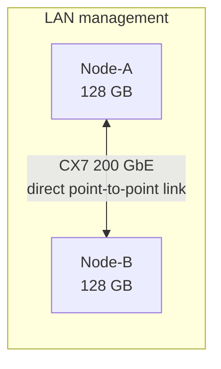

# dell-gb10-ai-node-pair

🌐 **Language / Langue:** English (current) · [Français](README.md)

Scripts & documentation for clustering two NVIDIA GB10 nodes (Grace Blackwell, 128 GB unified
memory each) over a direct ConnectX-7 link, for distributed training and distributed LLM inference.

## Goal

Automate and document, in a reproducible way, the pairing of two GB10 nodes: network validation
(management + dedicated CX7 link), NCCL collective validation, then loading and inference of a
model split across both nodes via the RPC backend of
[llama.cpp](https://github.com/ggml-org/llama.cpp).

> Hostnames, IP addresses and credentials in this repository are **anonymized examples**. All
> scripts are configurable via environment variables — see the header of each script.

## Prerequisites

- 2 × GB10 nodes (or equivalent NVIDIA Grace Blackwell), 128 GB each.
- ConnectX-7 card (or equivalent 200 GbE) with a vendor-validated compatible cable.
- Docker with the `nvidia` runtime configured on each node.
- SSH key dedicated to the inter-node link.

Full details: [docs/en/prerequisites.md](docs/en/prerequisites.md).

## Architecture



Details: [docs/en/architecture.md](docs/en/architecture.md) · networking: [docs/en/networking.md](docs/en/networking.md)
· NCCL/MPI: [docs/en/mpi-nccl.md](docs/en/mpi-nccl.md) · troubleshooting: [docs/en/troubleshooting.md](docs/en/troubleshooting.md)
· detailed results: [docs/en/benchmarks.md](docs/en/benchmarks.md)

## Quick start

```bash
# 1. Environment variables (adapt to your own cluster)
export MGMT_IP_A=10.0.0.11 MGMT_IP_B=10.0.0.12
export CX7_IP_A=10.10.0.1 CX7_IP_B=10.10.0.2
export REMOTE_USER=mluser SSH_KEY=~/.ssh/id_ed25519_cluster
export REMOTE_LLAMA_DIR=/opt/gb10-cluster/llama.cpp

# 2. End-to-end network/SSH/RDMA/GPU validation (run on either node)
./scripts/test_dual_gb10.sh --with-iperf3

# 3. Two-node NCCL smoke test (inside the ML container, on each node)
torchrun --nnodes=2 --nproc-per-node=1 --node-rank=<0|1> \
  --master-addr="$CX7_IP_A" --master-port=29500 scripts/smoke_ddp.py

# 4. Load a small split model (functional validation)
./scripts/test_model_split_rpc.sh models/qwen2.5-3b-instruct-q4_k_m.gguf

# 5. Throughput benchmark with a larger model
./scripts/bench_model_split_rpc.sh models/qwen2.5-14b-instruct-q4_k_m-00001-of-00003.gguf 512 128 3

# 6. Large-scale test, auto-adaptive to the memory available at run time, with safety guards
#    (periodic re-check + preventive abort if memory degrades during loading)
./scripts/bench_scale_model_split_rpc.sh            # diagnostic mode (no model)
./scripts/bench_scale_model_split_rpc.sh models/large-model-q4_k_m-00001-of-00012.gguf
```

## Measured results

| Test | Model | Result |
|---|---|---|
| NCCL collective (`torchrun`, 2 nodes) | — | `all_reduce=3.0` on both ranks — collective communication validated over CX7 |
| Functional validation (RPC split) | Qwen2.5-3B-Instruct, Q4_K_M (~2 GB) | VRAM split: ~2.9 GiB (local) + ~0.9 GiB (remote) — tensors genuinely partitioned, correct response |
| Throughput (`llama-bench`, RPC split) | Qwen2.5-14B-Instruct, Q4_K_M (8.37 GiB) | Prompt processing: **1566.75 t/s** · Generation: **20.35 t/s** · VRAM: ~5.3 GiB (local) + ~3.7 GiB (remote) |
| Network validation (`test_dual_gb10.sh`) | — | 9 PASS / 0 FAIL / 1 SKIP (iperf3 not installed on one of the two nodes at measurement time) |
| Large-scale test (`bench_scale_model_split_rpc.sh`) | Qwen2.5-72B-Instruct, Q4_K_M (~41 GiB, auto-split) | Load time: **68.2 s** · Network throughput during loading: **3.17 Gb/s** (1.6 % of the 200 Gb/s link) · VRAM: ~17.7 GiB (local) + ~26.0 GiB (remote) · Prompt: **51.76 t/s** · Generation: **4.55 t/s** · No disruption of existing workloads on the remote node |
| Very large-scale test (`bench_scale_model_split_rpc.sh`) | Qwen2.5-72B-Instruct, **FP16** (~135.9 GiB, 42 files, auto-split) | Load time: **284.1 s** · Volume transferred: **73.8 GiB** · Network throughput during loading: **2.23 Gb/s** (1.1 % of the 200 Gb/s link) · VRAM: ~64.1 GiB (local) + ~71.8 GiB (remote) · Prompt: **24.11 t/s** · Generation: **1.65 t/s** · No disruption of existing workloads on the remote node |

These results show a genuine partitioning of the model across both nodes (not a duplicated load),
with throughput measured reproducibly via the inference engine's native API. The network throughput
during loading stays well below the CX7 link's nominal capacity (the limiting factor is disk reads
and CPU-side tensor deserialization, not the network), and the generation throughput for a model of
this size split over RPC is markedly lower than for a smaller model (14B), since each generated
token crosses the network once more for every layer hosted on the remote node. The FP16 test
(~136 GB) illustrates the cluster's real combined capacity once both nodes' production workloads are
temporarily freed: over 200 GiB of combined unified memory remain measurable, but a model this size
saturates the RPC link's memory bandwidth and reduces generation throughput accordingly — a
trade-off to weigh against the intended use case.

## Roadmap

- [x] End-to-end network/SSH/RDMA validation
- [x] Two-node NCCL smoke test
- [x] Functional validation of model partitioning (RPC)
- [x] Throughput benchmark with a mid-size model (14B)
- [x] Auto-adaptive script for a large-scale test (loading, CX7 link saturation) with memory safety
      guards (periodic re-check + preventive abort) — see
      [scripts/bench_scale_model_split_rpc.sh](scripts/bench_scale_model_split_rpc.sh)
- [x] Large-scale test results with a model close to ~70B (see table above and
      [docs/en/benchmarks.md](docs/en/benchmarks.md) for the full breakdown)

## Security

- The llama.cpp RPC backend is experimental and unauthenticated/unencrypted: it is only used on the
  private point-to-point CX7 subnet, never exposed on the LAN or the Internet.
- SSH key dedicated to the inter-node link, never reused elsewhere.
- No secret, token or real credential should ever be committed — see [CONTRIBUTING.en.md](CONTRIBUTING.en.md).

## License

[MIT](LICENSE)
