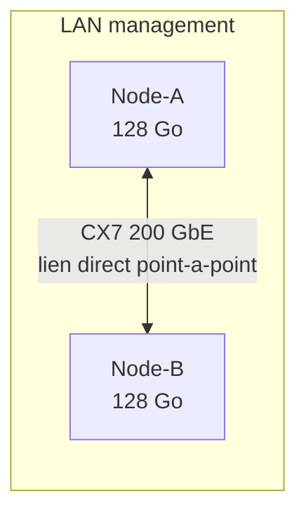

# dell-gb10-ai-node-pair

Scripts & documentation pour mettre en cluster deux nœuds NVIDIA GB10 (Grace Blackwell, 128 Go de
mémoire unifiée chacun) via une liaison directe ConnectX-7, pour l'entraînement distribué et
l'inférence répartie de LLMs.

## Objectif

Automatiser et documenter, de façon reproductible, la mise en relation de deux nœuds GB10 :
validation réseau (management + liaison CX7 dédiée), validation des collectives NCCL, puis
chargement et inférence d'un modèle réparti sur les deux nœuds via le backend RPC de
[llama.cpp](https://github.com/ggml-org/llama.cpp).

> Les noms d'hôtes, adresses IP et identifiants de ce dépôt sont des **exemples anonymisés**. Tous
> les scripts sont paramétrables par variables d'environnement — voir l'en-tête de chaque script.

## Prérequis

- 2 × nœuds GB10 (ou équivalent NVIDIA Grace Blackwell), 128 Go chacun.
- Carte ConnectX-7 (ou équivalent 200 GbE) avec câble compatible validé constructeur.
- Docker avec runtime `nvidia` configuré sur chaque nœud.
- Clé SSH dédiée à la liaison inter-nœuds.

Détails complets : [docs/prerequisites.md](docs/prerequisites.md).

## Architecture



Détails : [docs/architecture.md](docs/architecture.md) · réseau : [docs/networking.md](docs/networking.md)
· NCCL/MPI : [docs/mpi-nccl.md](docs/mpi-nccl.md) · dépannage : [docs/troubleshooting.md](docs/troubleshooting.md)

## Démarrage rapide

```bash
# 1. Variables d'environnement (adapter à votre propre cluster)
export MGMT_IP_A=10.0.0.11 MGMT_IP_B=10.0.0.12
export CX7_IP_A=10.10.0.1 CX7_IP_B=10.10.0.2
export REMOTE_USER=mluser SSH_KEY=~/.ssh/id_ed25519_cluster
export REMOTE_LLAMA_DIR=/opt/gb10-cluster/llama.cpp

# 2. Validation réseau/SSH/RDMA/GPU de bout en bout (exécuter sur l'un ou l'autre nœud)
./scripts/test_dual_gb10.sh --with-iperf3

# 3. Smoke test NCCL deux nœuds (dans le conteneur ML, sur chaque nœud)
torchrun --nnodes=2 --nproc-per-node=1 --node-rank=<0|1> \
  --master-addr="$CX7_IP_A" --master-port=29500 scripts/smoke_ddp.py

# 4. Chargement d'un petit modèle réparti (validation fonctionnelle)
./scripts/test_model_split_rpc.sh models/qwen2.5-3b-instruct-q4_k_m.gguf

# 5. Benchmark de débit avec un modèle plus gros
./scripts/bench_model_split_rpc.sh models/qwen2.5-14b-instruct-q4_k_m-00001-of-00003.gguf 512 128 3

# 6. Test à grande échelle, auto-adaptatif à la mémoire disponible du moment, avec garde-fous
#    (re-check périodique + arrêt préventif en cas de dégradation mémoire pendant le chargement)
./scripts/bench_scale_model_split_rpc.sh            # mode diagnostic (sans modèle)
./scripts/bench_scale_model_split_rpc.sh models/gros-modele-q4_k_m-00001-of-00012.gguf
```

## Résultats mesurés

| Test | Modèle | Résultat |
|---|---|---|
| Collective NCCL (`torchrun`, 2 nœuds) | — | `all_reduce=3.0` sur les deux rangs — communication collective validée sur CX7 |
| Validation fonctionnelle (RPC split) | Qwen2.5-3B-Instruct, Q4_K_M (~2 Go) | VRAM répartie : ~2.9 GiB (local) + ~0.9 GiB (distant) — tenseurs réellement partitionnés, réponse correcte |
| Débit (`llama-bench`, RPC split) | Qwen2.5-14B-Instruct, Q4_K_M (8.37 GiB) | Prompt processing : **1566.75 t/s** · Génération : **20.35 t/s** · VRAM : ~5.3 GiB (local) + ~3.7 GiB (distant) |
| Validation réseau (`test_dual_gb10.sh`) | — | 9 PASS / 0 FAIL / 1 SKIP (iperf3 non installé sur un des deux nœuds lors de la mesure) |

Ces résultats montrent un partitionnement réel du modèle entre les deux nœuds (et non un chargement
dupliqué), avec un débit mesuré de façon reproductible via l'API native de l'outil d'inférence.

## Feuille de route

- [x] Validation réseau/SSH/RDMA de bout en bout
- [x] Smoke test NCCL deux nœuds
- [x] Validation fonctionnelle du partitionnement de modèle (RPC)
- [x] Benchmark de débit avec un modèle de taille intermédiaire (14B)
- [x] Script auto-adaptatif pour un test à grande échelle (chargement, saturation du lien CX7) avec
      garde-fous mémoire (re-check périodique + arrêt préventif) — voir
      [scripts/bench_scale_model_split_rpc.sh](scripts/bench_scale_model_split_rpc.sh)
- [ ] Résultats du test à grande échelle avec un modèle proche de la capacité combinée (~70B+) —
      à ajouter une fois qu'une fenêtre de marge mémoire suffisante et stable sera disponible sur le
      second nœud (voir [docs/troubleshooting.md](docs/troubleshooting.md) pour le retour d'expérience
      sur la volatilité mémoire d'un nœud partagé)

## Sécurité

- Le backend RPC de llama.cpp est expérimental et non authentifié/chiffré : il n'est utilisé que sur
  le sous-réseau CX7 privé point-à-point, jamais exposé sur le LAN ni Internet.
- Clé SSH dédiée à la liaison inter-nœuds, jamais réutilisée ailleurs.
- Aucun secret, token ou identifiant réel ne doit être committé — voir [CONTRIBUTING.md](CONTRIBUTING.md).

## Licence

[MIT](LICENSE)
