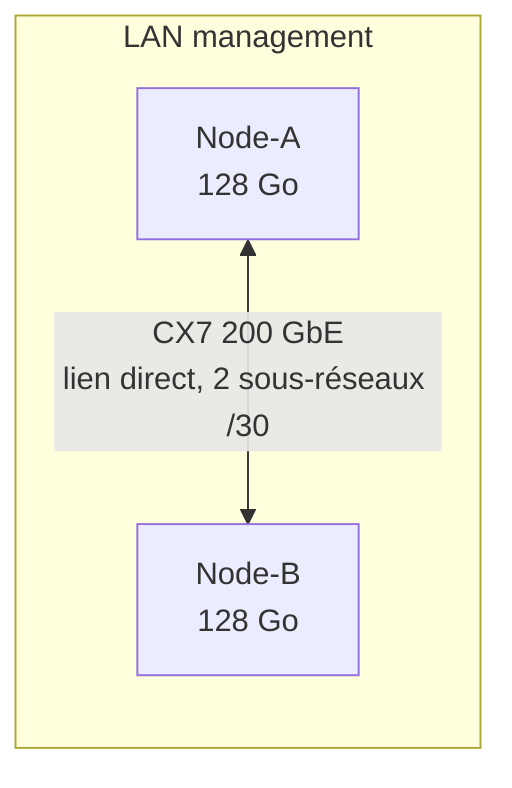

# Architecture

🌐 **Langue / Language:** Français (actuel) · [English](en/architecture.md)

## Vue d'ensemble

Deux nœuds GB10 (NVIDIA Grace Blackwell, 128 Go de mémoire unifiée chacun, soit 256 Go cumulés)
reliés par une liaison directe ConnectX-7 200 GbE, en plus de leur réseau de management habituel.

- **Réseau de management** : accès SSH, console, Internet contrôlé. Inchangé, route par défaut existante.
- **Liaison CX7 dédiée** : deux sous-réseaux point-à-point `/30` (un par interface logique du port
  ConnectX-7), sans passerelle ni DNS, utilisés uniquement pour le trafic de calcul distribué
  (NCCL, RPC d'inférence). Jamais exposée sur le LAN ni Internet.

## Mémoire unifiée Grace Blackwell : ce que ça change

Sur cette architecture, VRAM GPU et RAM système partagent le **même pool physique**. Deux
conséquences importantes :

1. `nvidia-smi --query-gpu=memory.total/used/free` peut renvoyer des champs vides selon la version
   de driver — la capacité totale fiable se lit dans les logs de l'outil d'inférence utilisé
   (ex. `ggml_cuda_init` de llama.cpp).
2. `nvidia-smi --query-compute-apps` ne voit que la mémoire attribuée aux processus CUDA : il est
   **aveugle** à la pression mémoire causée par des processus non-GPU (autres charges applicatives
   tournant sur le même nœud). Sur un nœud partagé avec d'autres services, la véritable contrainte à
   surveiller est `MemAvailable` dans `/proc/meminfo` (mémoire système, tous processus confondus),
   complétée par l'usage du swap.

## Ce que la connexion apporte (et n'apporte pas automatiquement)

- Les deux nœuds peuvent se partager des tâches (développement, tests, entraînement, inférence).
- Un moteur compatible (NCCL/MPI pour l'entraînement distribué, backend RPC de llama.cpp pour
  l'inférence) peut répartir poids et calculs entre eux.
- La liaison ne transforme **pas automatiquement** deux espaces mémoire de 128 Go en une mémoire
  unique de 256 Go accessible à n'importe quel logiciel : il faut une stratégie de parallélisme
  explicite et validée (DDP, FSDP, tensor/pipeline parallel, ou offload RPC).
- Deux instances indépendantes d'un même serveur d'inférence sur chaque machine ne deviennent pas
  automatiquement un seul grand serveur : la répartition réelle des poids doit être vérifiée
  (mesure de VRAM des deux côtés pendant l'inférence, voir [README](../README.md#résultats-mesurés)).

## Trois modes de répartition de charge

| Mode | Description | Besoin NCCL/RPC |
|---|---|---|
| Complémentaire | Chaque nœud exécute une tâche indépendante (ex. un modèle "développeur" sur un nœud, un modèle "reviewer" sur l'autre), résultats échangés au niveau applicatif | Non |
| Inférence répartie | Un seul modèle, trop gros pour un nœud, réparti sur les deux via offload réseau (ex. backend RPC llama.cpp) | Oui (RPC) |
| Entraînement distribué | Entraînement ou fine-tuning réparti sur les deux nœuds (DDP/FSDP/sharding) | Oui (NCCL/MPI) |

Voir [networking.md](networking.md) pour la configuration réseau et [mpi-nccl.md](mpi-nccl.md) pour
la validation des collectives NCCL.
