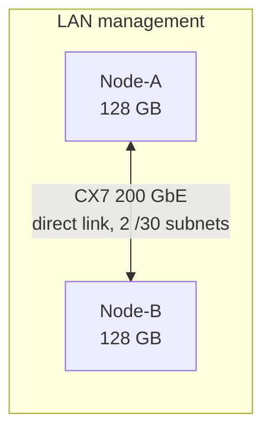

# Architecture

🌐 **Language / Langue:** English (current) · [Français](../architecture.md)

## Overview

Two GB10 nodes (NVIDIA Grace Blackwell, 128 GB unified memory each, 256 GB combined) connected by a
direct ConnectX-7 200 GbE link, in addition to their regular management network.

- **Management network**: SSH access, console, controlled Internet access. Unchanged, existing
  default route.
- **Dedicated CX7 link**: two point-to-point `/30` subnets (one per logical ConnectX-7 port
  interface), with no gateway or DNS, used only for distributed-compute traffic (NCCL, inference
  RPC). Never exposed on the LAN or the Internet.

## Grace Blackwell unified memory: what it changes

On this architecture, GPU VRAM and system RAM share the **same physical pool**. Two important
consequences:

1. `nvidia-smi --query-gpu=memory.total/used/free` may return empty fields depending on the driver
   version — the reliable total capacity is found in the logs of the inference engine in use
   (e.g. llama.cpp's `ggml_cuda_init`).
2. `nvidia-smi --query-compute-apps` only sees memory attributed to CUDA processes: it is **blind**
   to memory pressure caused by non-GPU processes (other application workloads running on the same
   node). On a node shared with other services, the real constraint to monitor is `MemAvailable` in
   `/proc/meminfo` (system memory, across all processes), complemented by swap usage.

## What the connection provides (and does not provide automatically)

- Both nodes can share workloads (development, testing, training, inference).
- A compatible engine (NCCL/MPI for distributed training, llama.cpp's RPC backend for inference)
  can split weights and computation between them.
- The link does **not automatically** turn two 128 GB memory spaces into a single 256 GB memory
  space accessible to any software: an explicit, validated parallelism strategy is required
  (DDP, FSDP, tensor/pipeline parallel, or RPC offload).
- Two independent instances of the same inference server running on each machine do not
  automatically become a single large server: the actual weight split must be verified
  (measuring VRAM on both sides during inference, see [README](../../README.en.md#measured-results)).

## Three load-distribution modes

| Mode | Description | NCCL/RPC needed |
|---|---|---|
| Complementary | Each node runs an independent task (e.g. a "developer" model on one node, a "reviewer" model on the other), results exchanged at the application level | No |
| Distributed inference | A single model, too large for one node, split across both via network offload (e.g. llama.cpp RPC backend) | Yes (RPC) |
| Distributed training | Training or fine-tuning split across both nodes (DDP/FSDP/sharding) | Yes (NCCL/MPI) |

See [networking.md](networking.md) for network configuration and [mpi-nccl.md](mpi-nccl.md) for
NCCL collective validation.
